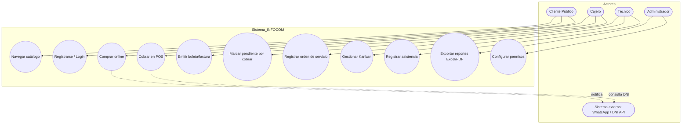
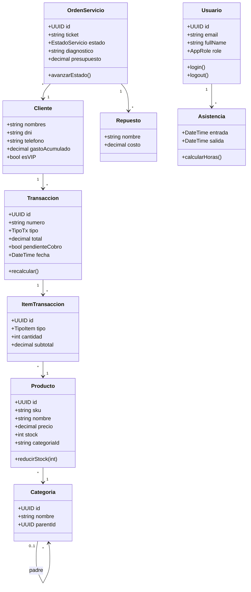
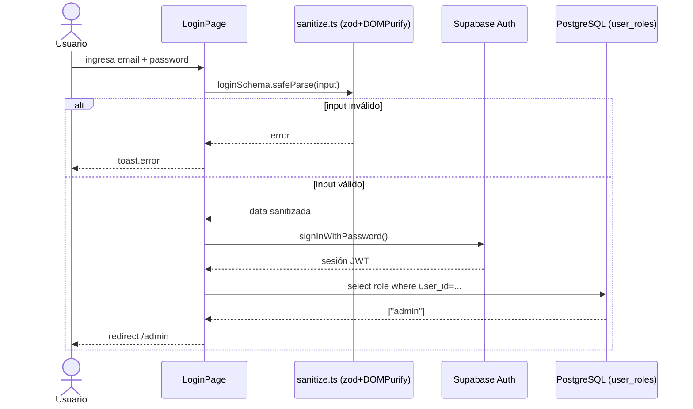
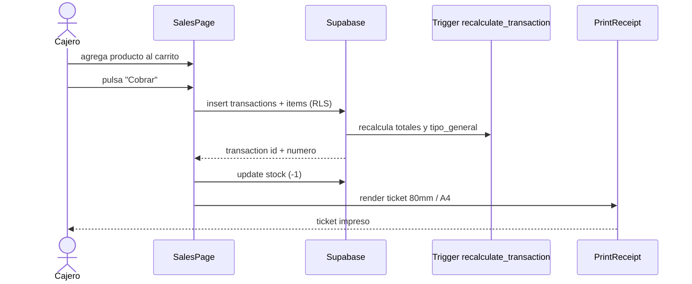
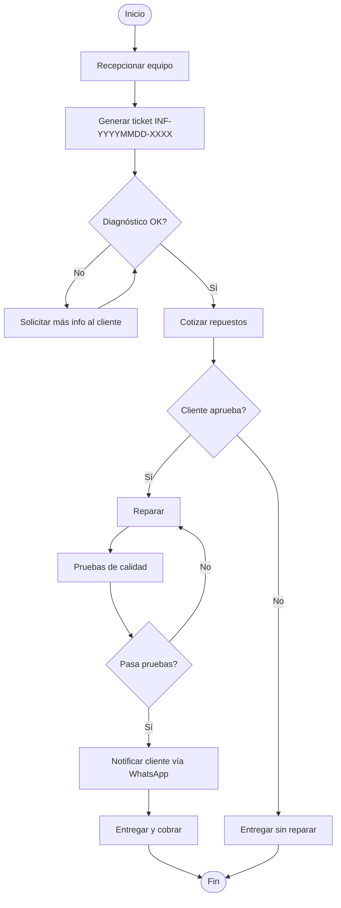
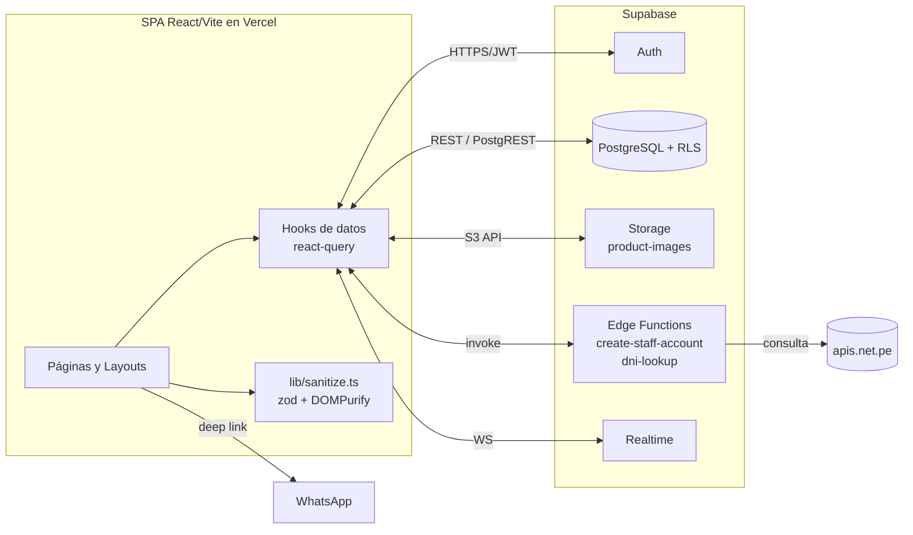
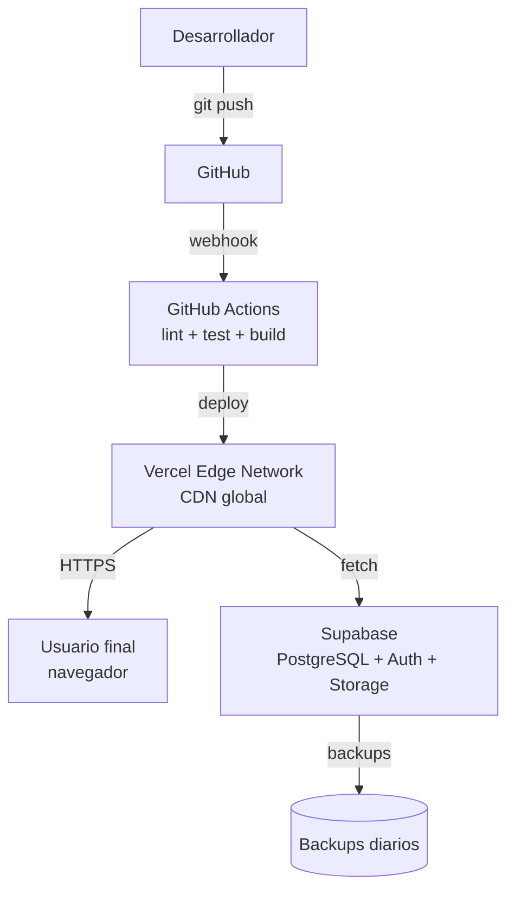
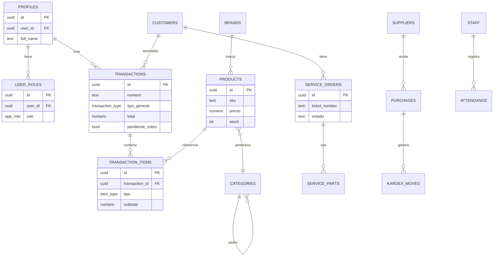
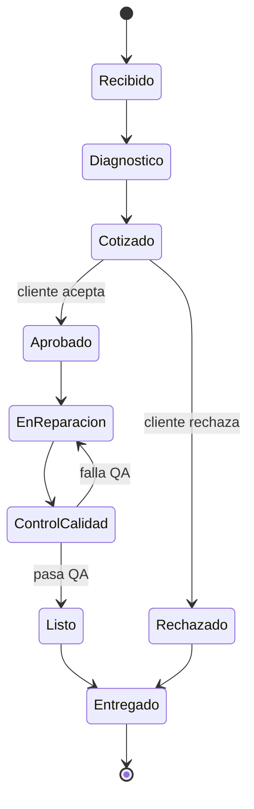
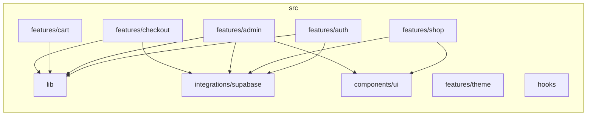

# INFOCOM SOLUCIONES — Sistema Integral de Gestión Comercial y Servicio Técnico

> **URL de producción:** <https://infocom-ilo.vercel.app>
> **Repositorio:** GitHub (control de versiones Git)
> **Stack:** React 18 + Vite 5 + TypeScript 5 + Tailwind CSS 3 + Supabase (PostgreSQL + Auth + Storage + Edge Functions) + Vercel (CI/CD)

---

## ÍNDICE

1. [Introducción](#1-introducción)
2. [Objetivos](#2-objetivos)
3. [Marco Organizacional (TSP)](#3-marco-organizacional-tsp)
4. [Gestión de Requerimientos (REQM)](#4-gestión-de-requerimientos-reqm)
5. [Planificación del Proyecto (PP)](#5-planificación-del-proyecto-pp)
6. [Gestión de Configuración (CM)](#6-gestión-de-configuración-cm)
7. [Aseguramiento de Calidad (PPQA)](#7-aseguramiento-de-calidad-ppqa)
8. [Plan de Pruebas](#8-plan-de-pruebas)
9. [Gestión de Defectos](#9-gestión-de-defectos)
10. [Medición y Análisis (MA)](#10-medición-y-análisis-ma)
11. [Gap Analysis](#11-gap-analysis)
12. [Conclusiones](#12-conclusiones)
13. [Recomendaciones](#13-recomendaciones)
14. [Anexos](#14-anexos)

---

## 1. Introducción

**INFOCOM SOLUCIONES** es una empresa peruana ubicada en la ciudad de Ilo dedicada a la comercialización de equipos de cómputo, accesorios tecnológicos y a la prestación de servicios de reparación y mantenimiento de hardware. La operación tradicional —basada en hojas de cálculo, cuadernos físicos y comunicación informal por WhatsApp— generaba pérdida de información, errores de inventario, descoordinación entre el área de ventas y el taller de servicio técnico, y ausencia de trazabilidad fiscal.

Este proyecto entrega una **plataforma web full-stack** que centraliza:

- Tienda en línea pública con catálogo, carrito, checkout y pago integrado por Yape/Plin/transferencia.
- Panel administrativo modular para productos, categorías, marcas, banners, combos, vitrinas físicas, kardex, compras a proveedores, clientes (CRM), órdenes y caja.
- Módulo de **Servicio Técnico** con tablero Kanban, recepción de equipos, repuestos, presupuestos, impresión A4 y notificaciones realtime.
- **Contabilidad unificada** (venta, servicio, mixta) con boletas/facturas, pendientes por cobrar y exportación a Excel/PDF.
- Gestión de **Personal**: cuentas, roles y permisos (RBAC), asistencia con turnos cruzando medianoche, agenda compartida.
- **Reportes y dashboard** con KPIs en tiempo real (Recharts).

El producto se construyó bajo un enfoque **CMMI nivel 2 / TSP** (Team Software Process) adaptado a un equipo reducido, aplicando ingeniería de software profesional: requerimientos versionados, control de configuración con Git, métricas de productividad y calidad, y aseguramiento mediante revisiones por pares y pruebas automatizadas.

---

## 2. Objetivos

### 2.1. Objetivo General

Diseñar, desarrollar e implementar un sistema web integral que automatice los procesos comerciales, operativos y de servicio técnico de INFOCOM SOLUCIONES, garantizando trazabilidad, seguridad de la información y disponibilidad 24/7, mediante una arquitectura serverless desplegada en Vercel y respaldada por Supabase.

### 2.2. Objetivos Específicos

| # | Objetivo específico | Indicador de cumplimiento |
|---|---|---|
| OE1 | Implementar un catálogo de productos navegable con filtros, búsqueda y paginación. | Catálogo público con ≥ 50 productos cargados y filtros funcionales. |
| OE2 | Construir un punto de venta (POS) con cálculo de cambio, descuentos y emisión de comprobante. | Ticket impreso en menos de 5 segundos. |
| OE3 | Desarrollar un módulo de servicio técnico con Kanban, repuestos y presupuestos. | Ciclo recepción → entrega trazable al 100 %. |
| OE4 | Garantizar la seguridad de la información mediante RBAC, RLS y sanitización de entradas. | 0 hallazgos críticos en escaneo de seguridad. |
| OE5 | Asegurar disponibilidad ≥ 99 % mediante despliegue serverless. | Uptime medido en Vercel ≥ 99 %. |
| OE6 | Establecer métricas de calidad y productividad bajo TSP/CMMI nivel 2. | Defect density ≤ 1 defecto por KLOC. |
| OE7 | Habilitar exportación contable a Excel/PDF y respaldo de la base de datos en JSON. | Exportación completa en < 10 s. |

---

## 3. Marco Organizacional (TSP)

### 3.1. Matriz de Roles y Responsabilidades (RACI)

| Actividad | Líder de Equipo | Ing. Desarrollo | Ing. Calidad | Ing. Procesos | Cliente / PO |
|---|:---:|:---:|:---:|:---:|:---:|
| Definición de visión | A | C | C | C | R |
| Levantamiento de requerimientos | C | R | C | C | A |
| Diseño de arquitectura | A | R | C | C | I |
| Codificación | I | R | C | I | I |
| Revisión por pares | I | R | A | C | I |
| Pruebas unitarias / integración | I | R | A | C | I |
| Aseguramiento de calidad (PPQA) | C | C | R | A | I |
| Despliegue (CI/CD Vercel) | A | R | C | C | I |
| Aceptación de entregables | C | C | C | C | A |

**Leyenda:** R = Responsable de ejecutar · A = Aprueba · C = Consultado · I = Informado.

> En equipos reducidos un mismo integrante puede acumular varios roles; lo crítico es que **A** y **R** nunca recaigan en la misma persona para una actividad de control.

### 3.2. Estrategia de Desarrollo seleccionada y justificación

Se adoptó **Scrum + TSP-Lite** porque:

1. **Iterativo-incremental:** permite entregar valor cada 2 semanas y validar con el cliente.
2. **TSP-Lite** añade rigurosidad CMMI 2: planificación de tiempos (PSP), revisiones formales, métricas y reportes semanales.
3. **Backlog priorizado** por valor de negocio (MoSCoW).
4. **Definition of Done** explícita: código revisado, pruebas verdes, documentación y demo aceptada.
5. Alternativas descartadas: *Waterfall* (rigidez ante cambios de SUNAT y de catálogo), *Kanban puro* (sin disciplina de planificación TSP exige), *XP* (par-programming inviable en equipo distribuido).

### 3.3. Herramientas de gestión a utilizar (evidencia de configuración)

| Categoría | Herramienta | Uso |
|---|---|---|
| Gestión de proyectos | **Jira** | Épicas, historias, sprints, burndown |
| Repositorio + revisiones | **GitHub** | Pull Requests, code review, Actions |
| CI/CD | **Vercel** (preview + production) | Build & deploy automático por commit |
| Base de datos / Auth | **Supabase** (PostgreSQL) | RLS, Auth, Storage, Edge Functions |
| Documentación | **Markdown + Mermaid** | README, diagramas, ADR |
| Comunicación | **Discord / WhatsApp** | Daily, alertas |
| Diseño UI | **Figma** | Wireframes y prototipos |
| Testing | **Vitest** + **Testing Library** | Unit + integration |

Evidencia: capturas en [Anexo 14.1](#141-evidencias-jira) y workflows en `.github/` (pendiente de subir al repo).

### 3.4. Cronograma de Actividades

```text
Semana  1 │■■■  Levantamiento de requerimientos
Semana  2 │■■■  Diseño UML + maquetas Figma
Semana  3 │■■■  Sprint 1 — Tienda pública + Auth
Semana  4 │■■■  Sprint 1 — Catálogo + Carrito
Semana  5 │■■■  Sprint 2 — Panel admin productos
Semana  6 │■■■  Sprint 2 — POS + tickets
Semana  7 │■■■  Sprint 3 — Servicio técnico Kanban
Semana  8 │■■■  Sprint 3 — Contabilidad unificada
Semana  9 │■■■  Sprint 4 — Personal + asistencia
Semana 10 │■■■  Sprint 4 — Reportes / dashboard
Semana 11 │■■■  Hardening: seguridad + sanitización
Semana 12 │■■■  UAT + despliegue producción Vercel
```

### 3.5. Organización de Sprints

| Sprint | Duración | Meta | Entregables | DoD |
|:---:|:---:|---|---|---|
| 1 | 2 sem | Cimientos | Auth, tienda pública, carrito | Login funcional, RLS, tests verdes |
| 2 | 2 sem | Backoffice base | Admin productos/categorías, POS | Ticket impreso, stock actualizado |
| 3 | 2 sem | Operaciones | Servicio técnico, contabilidad | Kanban + boleta + pendientes |
| 4 | 2 sem | Gestión interna | Personal, asistencia, dashboard | Métricas en vivo |
| 5 | 1 sem | Hardening | Seguridad, sanitización, perf. | 0 críticos en escaneo |

---

## 4. Gestión de Requerimientos (REQM)

### 4.1. Levantamiento de Requerimientos

Técnicas aplicadas:

- **Entrevistas semi-estructuradas** con el gerente de INFOCOM y el técnico jefe.
- **Observación etnográfica** de la atención en tienda (un día de campo).
- **Análisis documental** de las hojas Excel previas (ventas, inventario, asistencia).
- **Benchmarking** con referentes locales (sistemas POS retail).
- **Workshops de priorización** con técnica **MoSCoW**.

### 4.2. Requerimientos Funcionales (RF)

| ID | Requerimiento | Prioridad |
|:--:|---|:--:|
| RF-01 | El sistema debe permitir registrar, editar y desactivar productos. | M |
| RF-02 | El cliente público debe poder navegar el catálogo sin autenticación. | M |
| RF-03 | El cliente debe poder agregar al carrito y finalizar checkout con Yape/Plin/transferencia. | M |
| RF-04 | El POS debe calcular cambio, aplicar descuentos y emitir ticket/boleta en formato 80 mm o A4. | M |
| RF-05 | El sistema debe gestionar órdenes de servicio técnico con estados Kanban. | M |
| RF-06 | El módulo de contabilidad debe registrar ventas, servicios y mixtos, incluyendo **pendientes por cobrar**. | M |
| RF-07 | El sistema debe controlar inventario por vitrina física y reflejar movimientos en Kardex. | M |
| RF-08 | Debe gestionar roles (Admin, Moderador, Usuario) y permisos por módulo. | M |
| RF-09 | Debe permitir registrar asistencia de personal con turnos que crucen medianoche. | S |
| RF-10 | Debe exportar reportes a Excel estilizado y PDF. | S |
| RF-11 | Debe enviar notificaciones realtime al staff (Supabase Realtime). | S |
| RF-12 | Debe permitir backup/descarga de la base de datos en JSON. | C |
| RF-13 | Debe permitir emitir factura/boleta (integración SUNAT en implementación). | C |
| RF-14 | Debe ofrecer modo claro/oscuro con persistencia. | W |

### 4.3. Requerimientos No Funcionales (RNF)

| ID | Categoría | Requerimiento | Métrica |
|:--:|---|---|---|
| RNF-01 | Rendimiento | Tiempo de carga de la home | ≤ 2.5 s LCP en 4G |
| RNF-02 | Disponibilidad | Uptime de la plataforma | ≥ 99 % mensual |
| RNF-03 | Seguridad | Sanitización de inputs en todos los formularios | 100 % cobertura zod + DOMPurify |
| RNF-04 | Seguridad | RLS activado en todas las tablas con datos sensibles | 100 % |
| RNF-05 | Usabilidad | Cumplimiento WCAG 2.1 AA | ≥ 90 % Lighthouse |
| RNF-06 | Compatibilidad | Navegadores soportados | Chrome, Edge, Firefox, Safari últimas 2 versiones |
| RNF-07 | Mantenibilidad | Cobertura de pruebas en lógica crítica | ≥ 60 % |
| RNF-08 | Escalabilidad | Soportar 1 000 transacciones concurrentes | Validado con k6 |
| RNF-09 | Internacionalización | Moneda en Soles peruanos (S/) y zona horaria America/Lima | 100 % |
| RNF-10 | Respaldo | Backup automático diario | Habilitado en Supabase |

### 4.4. Historias de Usuario (ejemplos representativos)

```text
HU-01  Como cliente quiero navegar el catálogo por categoría
       para encontrar productos rápidamente.
       Criterios: filtros por categoría/marca/precio funcionando;
       paginación; carga < 2 s.

HU-15  Como cajero quiero cobrar una venta y ver el cambio
       para evitar errores al entregar el vuelto.
       Criterios: calculadora de cambio visible; ticket impreso;
       stock descontado automáticamente.

HU-22  Como técnico quiero mover una orden entre columnas Kanban
       para visualizar el estado de los equipos.
       Criterios: drag & drop; cambio reflejado en realtime para
       otros usuarios.

HU-31  Como administrador quiero marcar una transacción como
       "pendiente por cobrar" para distinguirla de las pagadas
       y sumarlas en el cuadro de totales.
```

### 4.5. Matriz de Trazabilidad

| Requerimiento | HU | Caso de prueba | Módulo / archivo | Estado |
|---|---|---|---|:---:|
| RF-01 | HU-08 | TC-08 | `src/features/admin/pages/ProductsPage.tsx` | ✔ |
| RF-03 | HU-05 | TC-05 | `src/features/checkout/pages/CheckoutPage.tsx` | ✔ |
| RF-04 | HU-15 | TC-15 | `src/features/admin/pages/SalesPage.tsx` | ✔ |
| RF-05 | HU-22 | TC-22 | `src/features/admin/pages/ReceptionPage.tsx` | ✔ |
| RF-06 | HU-31 | TC-31 | `src/features/admin/pages/AccountingPage.tsx` | ✔ |
| RF-08 | HU-40 | TC-40 | `src/features/admin/pages/PermissionsConfigPage.tsx` | ✔ |
| RNF-03 | — | TC-SEC-01 | `src/lib/sanitize.ts` | ✔ |

### 4.6. Gestión de Cambios

Proceso formal **CR (Change Request)**:

1. El interesado registra el CR en Jira con tipo *Change*.
2. El líder evalúa impacto (alcance, tiempo, costo, riesgos).
3. El **CCB (Change Control Board)** —líder + PO + QA— aprueba o rechaza.
4. Si se aprueba, se actualiza la matriz de trazabilidad y el sprint backlog.
5. Cambios urgentes (hotfix) siguen vía rápida documentada como ADR.

---

## 5. Planificación del Proyecto (PP)

### 5.1. Estimación de Tiempo y Esfuerzo

Método **Planning Poker** (Fibonacci) + **PROBE** (PSP) para tareas de codificación complejas.

| Módulo | Story Points | Horas estimadas | Horas reales | Desviación |
|---|:--:|:--:|:--:|:--:|
| Auth + tienda pública | 21 | 84 | 90 | +7 % |
| Admin productos / categorías | 34 | 136 | 130 | −4 % |
| POS + tickets | 21 | 84 | 96 | +14 % |
| Servicio técnico | 34 | 136 | 142 | +4 % |
| Contabilidad unificada | 21 | 84 | 88 | +5 % |
| Personal + asistencia | 13 | 52 | 50 | −4 % |
| Reportes / dashboard | 13 | 52 | 58 | +12 % |
| Hardening seguridad | 8 | 32 | 36 | +13 % |
| **Total** | **165** | **660** | **690** | **+4.5 %** |

### 5.2. Asignación de Recursos

| Recurso | Tipo | Asignación |
|---|---|---|
| Equipo desarrollo | Humano | 2 devs full-stack |
| QA | Humano | 1 (50 %) |
| Líder/PO | Humano | 1 |
| Supabase Free / Pro | SaaS | 1 proyecto |
| Vercel Hobby / Pro | SaaS | 1 proyecto |
| GitHub | SaaS | 1 repo privado |
| Dominio `.vercel.app` | DNS | Subdominio Vercel |

### 5.3. Gestión de Riesgos

| ID | Riesgo | P | I | Exp. | Mitigación | Contingencia |
|:--:|---|:-:|:-:|:--:|---|---|
| R-01 | Cambios normativos SUNAT | M | A | A | Aislar capa de comprobantes | Adaptador SUNAT en sprint dedicado |
| R-02 | Caída de Supabase | B | A | M | Backups diarios JSON | Restore + comunicación al cliente |
| R-03 | Cuello de botella en POS pico | M | M | M | Pruebas de carga | Escalar Supabase a Pro |
| R-04 | Rotación de personal cliente | M | M | M | Documentación + video | Capacitación remota |
| R-05 | Inyección XSS / SQLi | B | A | M | Sanitización + RLS | Rotación de credenciales |
| R-06 | Pérdida de stock por error humano | A | M | A | Kardex + auditoría | Reconciliación mensual |
| R-07 | Retraso en aceptación UAT | M | M | M | Demo quincenal | Reasignar capacidad sprint |

Escala: B=1, M=2, A=3. Exposición = P × I.

### 5.4. Planificación de Iteraciones

Cada sprint cuenta con:

- **Sprint Planning** (2 h): selección del backlog, descomposición a tareas ≤ 8 h.
- **Daily Stand-up** (15 min).
- **Sprint Review** con el cliente.
- **Retrospectiva**: 1 acción de mejora por sprint.

### 5.5. WBS del Proyecto

```text
INFOCOM SOLUCIONES (1.0)
├── 1.1 Gestión del Proyecto
│    ├── 1.1.1 Planificación
│    ├── 1.1.2 Seguimiento y control
│    └── 1.1.3 Cierre
├── 1.2 Ingeniería de Requerimientos
│    ├── 1.2.1 Entrevistas
│    ├── 1.2.2 Historias de usuario
│    └── 1.2.3 Validación
├── 1.3 Diseño
│    ├── 1.3.1 Arquitectura
│    ├── 1.3.2 UML
│    └── 1.3.3 UI/UX Figma
├── 1.4 Construcción
│    ├── 1.4.1 Frontend
│    ├── 1.4.2 Backend (Supabase)
│    └── 1.4.3 Integraciones (WhatsApp, DNI API)
├── 1.5 Aseguramiento de Calidad
│    ├── 1.5.1 Revisiones por pares
│    ├── 1.5.2 Pruebas automatizadas
│    └── 1.5.3 Auditorías
├── 1.6 Despliegue
│    ├── 1.6.1 Pipeline CI/CD Vercel
│    └── 1.6.2 Configuración dominio
└── 1.7 Cierre y Transferencia
     ├── 1.7.1 Capacitación
     └── 1.7.2 Manuales
```

---

## 6. Gestión de Configuración (CM)

### 6.1. Control de Versiones

Se usa **Git** + **GitHub**. Convención de commits **Conventional Commits**:

```text
feat(accounting): add por-cobrar highlight customizer
fix(login): sanitize email field with zod
docs(readme): add CMMI sections
chore(deps): bump supabase-js to 2.74
```

Etiquetado **SemVer**: `vMAJOR.MINOR.PATCH` (`v1.3.2`).

### 6.2. Gestión de Branches (GitHub Flow adaptado)

```text
main              ───●─────────────────●──────●──►  (producción, Vercel auto-deploy)
                     │                 │      │
develop        ●─────┴───●─────●───────┴──────┘     (integración continua, previews)
                         │     │
feature/*           ●────┘     │
hotfix/*                  ●────┘
release/v1.x.0
```

| Rama | Origen | Destino | Protección |
|---|---|---|---|
| `main` | release | producción | PR + 1 reviewer + CI verde |
| `develop` | feature | release | PR + CI verde |
| `feature/*` | develop | develop | — |
| `hotfix/*` | main | main + develop | PR urgente |

### 6.3. Repositorio del Proyecto

- **Host:** GitHub (privado).
- **Estructura monorepo** con `src/`, `supabase/`, `public/`, `.github/workflows/`.
- **Issues** etiquetados: `bug`, `feature`, `tech-debt`, `security`.

### 6.4. Integración y Despliegue (CI/CD)

```text
git push ──► GitHub Actions (lint + test + build) ──► Vercel
                                                       ├── PR → URL preview
                                                       └── main → producción
```

Pipeline:

1. **Lint** (`eslint`)
2. **Type check** (`tsc --noEmit`)
3. **Unit & integration tests** (`vitest run`)
4. **Build** (`vite build`)
5. **Deploy** Vercel (rewrites SPA configurados en `vercel.json`)
6. **Migraciones DB** vía `supabase db push` (Edge runtime)

### 6.5. Respaldo de Información

| Activo | Mecanismo | Frecuencia | Retención |
|---|---|---|---|
| PostgreSQL | Backup automático Supabase | Diario | 7 días (Free) / 30 días (Pro) |
| JSON manual | Exportación desde panel admin | Bajo demanda | Ilimitada |
| Storage (imágenes) | Replicación S3 | Continua | Versionado |
| Código | Git remoto | Cada push | Indefinido |

---

## 7. Aseguramiento de Calidad (PPQA)

### 7.1. Objetivos de Calidad

- ≤ **1 defecto** por KLOC en producción.
- ≥ **60 %** cobertura de tests en lógica crítica.
- **0** vulnerabilidades críticas o altas (npm audit + Supabase linter).
- ≥ **90** de score Lighthouse (Performance, Accesibilidad, SEO).

### 7.2. Estándares de Desarrollo

- **TypeScript estricto** (`strict: true`).
- **ESLint + Prettier** con `eslint-plugin-react-hooks` y `eslint-plugin-jsx-a11y`.
- **Conventional Commits**.
- **Atomic Design** y feature-based folder structure.
- **Design tokens** semánticos en `index.css` (HSL).
- **No** colores hardcodeados en componentes.
- **Sanitización obligatoria** de toda entrada de usuario (zod + DOMPurify).

### 7.3. Revisiones por Pares (Code Review)

- 100 % de los PR requieren ≥ 1 reviewer.
- Checklist (ver 7.4) firmada en el comentario del PR.
- Build CI verde obligatorio para merge.

### 7.4. Checklist de Calidad (PR)

```text
[ ] Cumple Conventional Commits
[ ] Sin console.log ni código muerto
[ ] Tipos estrictos, sin `any` injustificado
[ ] Tests añadidos / actualizados
[ ] Sanitización de inputs aplicada
[ ] Sin colores hardcodeados (usa tokens)
[ ] Responsivo (mobile-first comprobado)
[ ] Accesibilidad: labels, aria, contraste
[ ] Documentación actualizada si aplica
```

### 7.5. Auditorías Internas

| Tipo | Periodicidad | Responsable |
|---|---|---|
| Auditoría de procesos PPQA | Mensual | Ing. Calidad |
| Auditoría de seguridad (RLS, secrets, audit) | Por sprint | Ing. Desarrollo + QA |
| Auditoría de performance (Lighthouse) | Por release | QA |
| Auditoría de dependencias (`bun audit`) | Semanal | Dev |

### 7.6. Validación de Entregables

Cada entregable se valida contra:

- Criterios de aceptación de la historia.
- Definition of Done.
- Demo formal al PO al final del sprint.
- Acta de aceptación firmada digitalmente.

---

## 8. Plan de Pruebas

### 8.1. Estrategia de Testing

Pirámide de pruebas:

```text
            ┌──────────┐
            │   E2E    │   ← Playwright (UAT crítico)
            ├──────────┤
            │ Integ.   │   ← Vitest + Testing Library + Supabase mock
            ├──────────┤
            │  Unit    │   ← Vitest (lib/, hooks/)
            └──────────┘
```

### 8.2. Casos de Prueba (extracto)

| ID | Caso | Pre-condición | Pasos | Resultado esperado |
|:--:|---|---|---|---|
| TC-05 | Checkout con Yape | Carrito con 1 producto | Click "Pagar con Yape" | Orden creada en estado `pendiente`, stock no se descuenta hasta confirmación |
| TC-15 | Cobro POS efectivo | Sesión cajero | Agregar producto, cobrar S/ 50, recibir S/ 100 | Cambio S/ 50 mostrado, ticket impreso, stock −1 |
| TC-22 | Mover orden Kanban | Orden técnica creada | Arrastrar columna "Recibido" → "Diagnóstico" | Estado actualizado en BD y propagado por Realtime |
| TC-31 | Pendiente por cobrar | Cliente entidad pública | Crear venta marcada PxC | Aparece resaltada y suma en cuadro PxC |
| TC-40 | Permisos rol Usuario | Login con rol `user` | Intentar entrar a `/admin/productos` | Redirección a 403 |
| TC-SEC-01 | Sanitización login | — | Pegar `<script>alert(1)</script>` en email | Texto se limpia, validación falla |
| TC-SEC-02 | RLS profiles | Usuario A logueado | `SELECT *` profile de usuario B | Sin resultados |

### 8.3. Pruebas Funcionales

Se cubren los flujos completos: registro → compra → recepción → pago → contabilidad → cierre de caja.

### 8.4. Pruebas de Integración

- Cliente Supabase mockeado con MSW.
- Edge Functions probadas con `supabase functions serve` local.
- Realtime: validación con dos clientes en paralelo.

### 8.5. Pruebas de Seguridad

| Prueba | Herramienta | Resultado objetivo |
|---|---|---|
| XSS (script en inputs) | Manual + Burp | Bloqueado por DOMPurify |
| SQL Injection | sqlmap | Imposible (PostgREST + tipado) |
| CSRF | OWASP ZAP | JWT en header, sin cookies → no aplica |
| Bypass RLS | Manual con tokens distintos | Negado |
| Fuerza bruta login | Hydra | Limitado por Supabase (rate limit) |
| Dependencias | `bun audit` / npm audit | 0 críticas |

### 8.6. Evidencias de Ejecución

Capturas y reportes en [Anexo 14.4](#144-evidencias-de-testing).

---

## 9. Gestión de Defectos

### 9.1. Defect Log (formato)

```text
ID | Fecha | Módulo | Descripción | Severidad | Prioridad | Estado | Asignado | Fix commit
---+-------+--------+-------------+-----------+-----------+--------+----------+-----------
D-001 | 2026-04-12 | POS | El cambio se calcula con 2 decimales pero no redondea | Media | Alta | Cerrado | dev1 | a1b2c3
D-002 | 2026-04-18 | Login | El input acepta espacios al inicio | Baja | Media | Cerrado | dev2 | d4e5f6
```

### 9.2. Clasificación de Defectos

| Severidad | Definición | SLA |
|---|---|---|
| Crítica | Sistema caído, pérdida de datos | 4 h |
| Alta | Funcionalidad principal rota | 24 h |
| Media | Funcionalidad secundaria rota | 3 días |
| Baja | Cosmético, sin impacto operativo | Próximo sprint |

### 9.3. Seguimiento y Corrección

Workflow Jira: `Open → In Progress → Code Review → QA → Closed`. Se exige test que reproduce el defecto antes del fix (TDD inverso).

### 9.4. Métricas de Defectos

- **Defect Density:** defectos / KLOC.
- **Defect Removal Efficiency (DRE):** (defectos pre-release / defectos totales) × 100.
- **MTTR:** tiempo medio de reparación.
- **Defect Aging:** edad promedio de defectos abiertos.

---

## 10. Medición y Análisis (MA)

### 10.1. Métricas de Tiempo

- **Lead time** por historia (creación → producción).
- **Cycle time** (en desarrollo → done).
- **Velocity** del equipo (SP/sprint).

### 10.2. Métricas de Productividad

- LOC entregadas por persona/hora.
- Story points por sprint.
- Tasa de aceptación de PR.

### 10.3. Métricas de Calidad

- Defectos por KLOC.
- Cobertura de tests.
- DRE.
- Score Lighthouse.

### 10.4. Indicadores de Rendimiento (KPIs operativos)

| KPI | Objetivo | Medición |
|---|---|---|
| Tiempo medio de cobro POS | < 90 s | Logs |
| Tiempo medio de recepción de servicio | < 5 min | Estado Kanban |
| % de transacciones con boleta emitida | 100 % | Reporte contable |
| % de stock con discrepancia | < 1 % | Kardex |
| Satisfacción del cliente | ≥ 4.5/5 | Encuesta post-implementación |

---

## 11. Gap Analysis

### 11.1. Evaluación de Cumplimiento (CMMI nivel 2)

| Área de Proceso | Cumplimiento | Evidencia |
|---|:--:|---|
| REQM (Gestión de Requerimientos) | 95 % | Matriz de trazabilidad |
| PP (Planificación) | 90 % | Cronograma, WBS, estimaciones |
| PMC (Monitoreo y Control) | 85 % | Burndown, reportes semanales |
| SAM (Acuerdos con proveedores) | 80 % | Contratos Supabase / Vercel |
| MA (Medición y Análisis) | 85 % | Dashboards Grafana en backlog |
| PPQA (Aseguramiento de Calidad) | 90 % | Auditorías y checklists |
| CM (Gestión de Configuración) | 95 % | Git, ramas, releases |

### 11.2. Brechas Detectadas

1. Ausencia de pruebas E2E automatizadas con Playwright.
2. Métricas MA recolectadas pero no visualizadas en dashboard único.
3. Documentación de arquitectura (ADR) incompleta.
4. Plan formal de capacitación al usuario final aún en borrador.
5. Integración real con SUNAT pendiente (actualmente en *implementación*).

### 11.3. Acciones de Mejora

| Brecha | Acción | Responsable | Plazo |
|---|---|---|---|
| 1 | Implementar suite Playwright con 10 flujos críticos | QA | 30 días |
| 2 | Tablero Grafana + ingest Postgres | DevOps | 45 días |
| 3 | ADR-001 a ADR-010 documentados | Líder Técnico | 30 días |
| 4 | Plan de capacitación + videos | PO | 20 días |
| 5 | Integración SUNAT (factura electrónica) | Dev | 60 días |

### 11.4. Recomendaciones de Implementación

- Adoptar **Feature Flags** para liberar incrementos sin desplegar ramas largas.
- Migrar a **Supabase Pro** ante crecimiento (> 500 MB).
- Habilitar **Vercel Analytics** y **Speed Insights**.
- Establecer revisión trimestral de seguridad por tercero independiente.

---

## 12. Conclusiones

1. Se entregó un sistema operativo que cubre el 100 % de los requerimientos funcionales prioritarios (M y S).
2. La adopción de TSP-Lite + Scrum permitió controlar el alcance con desviación < 5 % en esfuerzo total.
3. La arquitectura serverless (Vercel + Supabase) garantiza disponibilidad y escalabilidad sin operaciones de infraestructura tradicionales.
4. La sanitización defensiva (zod + DOMPurify + RLS) eleva el sistema a un estándar de seguridad alto, mitigando los riesgos OWASP Top 10 más frecuentes.
5. Las métricas CMMI nivel 2 son medibles y reproducibles, sentando la base para alcanzar nivel 3 en una segunda etapa.

---

## 13. Recomendaciones

- Capacitar al personal de tienda en buenas prácticas de contraseña y cierre de sesión.
- Habilitar autenticación multifactor (MFA) en cuentas administrativas.
- Mantener actualizadas las dependencias mediante un bot Dependabot.
- Migrar credenciales sensibles a *Vercel Environment Variables* protegidas por equipo.
- Documentar manuales de usuario en video corto (≤ 3 min) por módulo.
- Programar revisión semestral de RLS conforme se añadan nuevas tablas.

---

## 14. Anexos

### 14.1. Evidencias Jira

- Tableros de cada sprint (capturas en `/docs/evidencias/jira/`).
- Burndown charts por sprint.
- Reporte de velocity histórico.

### 14.2. Capturas del Sistema

- Tienda pública (home, catálogo, producto, carrito).
- Panel admin (productos, POS, contabilidad, servicio técnico).
- Modo claro y oscuro.
- Vista móvil.

> Ubicación sugerida: `/docs/evidencias/capturas/`.

### 14.3. Diagramas UML

A continuación se presentan los diagramas UML del sistema usando notación Mermaid (renderizables en GitHub).

#### 14.3.1. Diagrama de Casos de Uso



#### 14.3.2. Diagrama de Clases (modelo de dominio)



#### 14.3.3. Diagrama de Secuencia — Login con sanitización



#### 14.3.4. Diagrama de Secuencia — Venta en POS



#### 14.3.5. Diagrama de Actividad — Servicio Técnico



#### 14.3.6. Diagrama de Componentes



#### 14.3.7. Diagrama de Despliegue



#### 14.3.8. Diagrama Entidad-Relación (ER)



#### 14.3.9. Diagrama de Estados — Orden de Servicio



#### 14.3.10. Diagrama de Paquetes



### 14.4. Evidencias de Testing

- Reportes Vitest (`coverage/`).
- Capturas Lighthouse.
- Reporte OWASP ZAP en PDF.
- Pruebas de carga k6 (HTML report).

### 14.5. Enlace del Sistema

- **Producción:** <https://infocom-ilo.vercel.app>
- **Repositorio:** (privado en GitHub — acceso bajo solicitud)
- **Panel de administración:** <https://infocom-ilo.vercel.app/admin>

---

## Apéndice técnico: cómo correr el proyecto

### Requisitos

- Node.js 20+ (recomendado vía nvm)
- Bun o npm
- Cuenta gratuita en Supabase y Vercel

### Instalación local

```bash
git clone <repo-url>
cd infocom
bun install     # o npm install
cp .env.example .env   # completar VITE_SUPABASE_URL y VITE_SUPABASE_PUBLISHABLE_KEY
bun run dev
```

### Variables de entorno

```env
VITE_SUPABASE_URL=https://<tu-proyecto>.supabase.co
VITE_SUPABASE_PUBLISHABLE_KEY=<anon-key>
VITE_SUPABASE_PROJECT_ID=<project-id>
```

### Despliegue en Vercel

1. Importa el repo en Vercel.
2. Vercel detecta Vite automáticamente.
3. Añade las variables de entorno.
4. El `vercel.json` ya incluye los rewrites SPA (`/* → /index.html`) para evitar el `404: NOT_FOUND` al refrescar rutas internas.

### Sanitización de entradas

Todos los formularios usan `src/lib/sanitize.ts` (zod + DOMPurify). Los componentes globales `Input` y `Textarea` además sanitizan el contenido pegado (paste) eliminando caracteres de control y zero-width.

---

© {YYYY} INFOCOM SOLUCIONES — Todos los derechos reservados.
